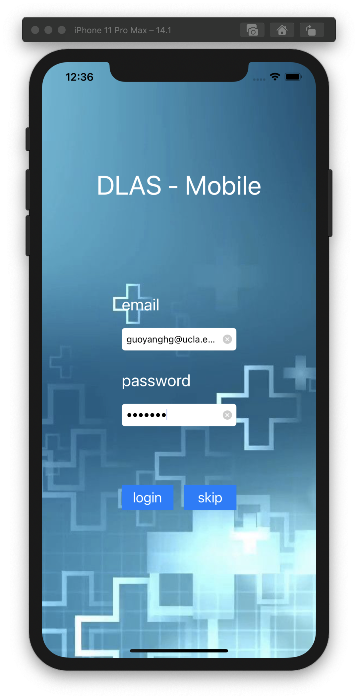
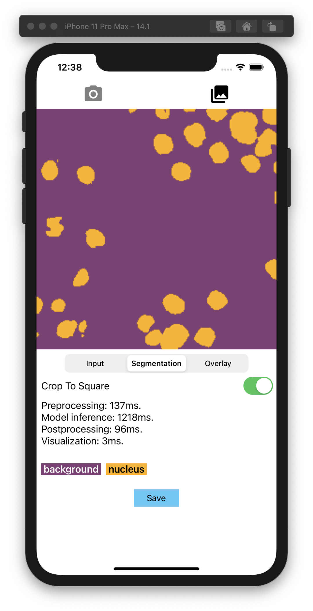

# DALS Cell Segmentation iOS 
This project developed based Tensorflow-lite official template

<p float="left">


</p>

## Requirements

*  Xcode 10.3 (installed on a Mac machine)
*  An iOS Simulator running iOS 12 or above
*  Xcode command-line tools (run ```xcode-select --install```)
*  CocoaPods (run ```sudo gem install cocoapods```)

## Build and run

1. Clone the repository and copy ./ios folder to your computer to get the
demo
application.<br/>
1. Install the pod to generate the workspace file:<br/>
```cd ./ios && pod install```<br/>
Note: If you have installed this pod before and that command doesn't work, try ```pod update```.<br/>
At the end of this step you should have a directory called ```ImageSegmentation.xcworkspace```.
1. Download the tensorflow-lite model by <a href="https://drive.google.com/file/d/1fulEL2mnsiMvzZz9yBZniPOIhnkzq1e9/view?usp=sharing">Google Drive</a> then copy "model" folder under "ImageSegmentation" folder<br/>
1. Open the project in Xcode with the following command:<br/>
```open ImageSegmentation.xcworkspace```<br/>
This launches Xcode and opens the ```ImageSegmentation``` project.
1. Setup the server first then modify LoginViewController line 47, change the hostip into your server IP(make sure your mobile testing device and server be in the same local network)
1. Select `Product -> Run` to install the app on an iOS Simulator or a physical
device.
